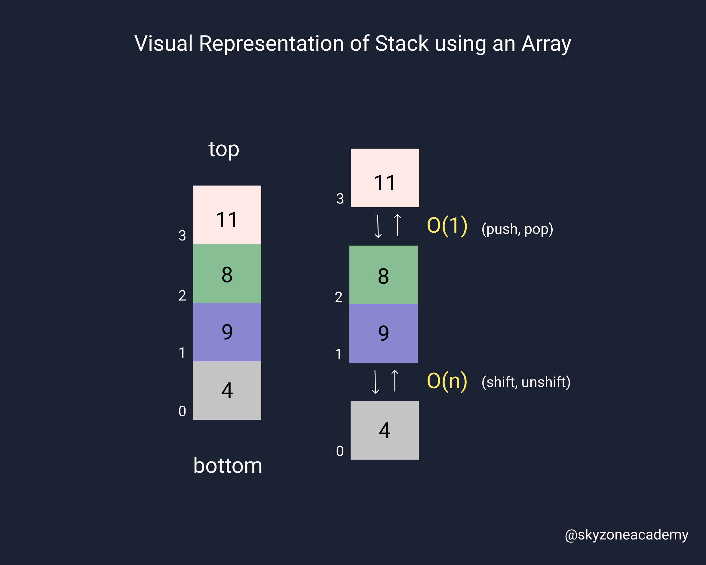
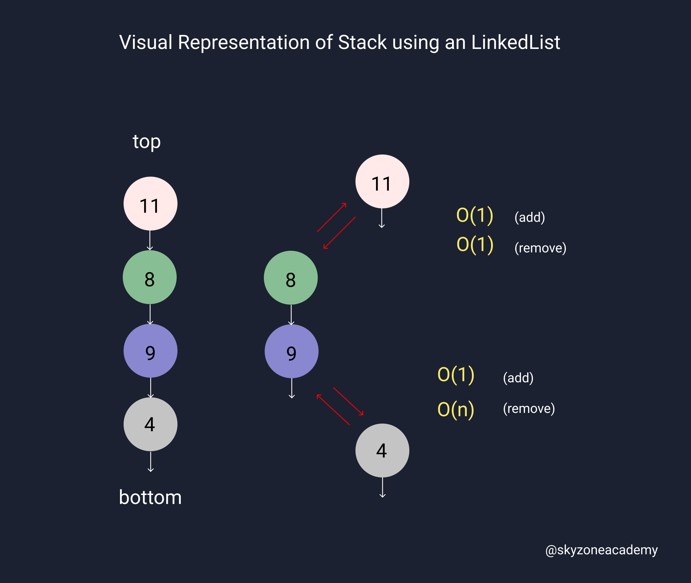

# Stack

## Introduction

- They are similar to **arrays** in that they are a **sequenced order** of numbers.
- **LIFO** (Last in First out)
- They **aren’t** supported natively in Javascript.
- To utilize this structure, one needs to create the class themselves.
- We can use `arrays` or `linkedlists` to implement a stack.

## Array Implementation Example

---

```javascript
class Stack() {
    constructor() {
        this.items = [];
    }
    // push item to the stack
    push(item) {
        this.items.push(item);
    }
    // remove item from the stack
    pop() {
        return this.items.pop();
    }
    // return the top item
    peek() {
        return this.items[this.items.length - 1];
    }
    // check if stack is empty
    isEmpty() {
        return this.items.length === 0;
    }
    // return the size of the stack
    size() {
        return this.items.length;
    }
    // clear the stack
    clear() {
        this.items = [];
    }
}

let stack = new Stack();
stack.push(1);
stack.push(2);
stack.push(3);
console.log(stack.peek()); // 3
```

## LinkedList Implementation Example

---

```javascript
class Node {
    constructor(value) {
        this.value = value;
        this.next = null;
    }
}

class Stack {
    constructor(value) {
        const newNode = new Node(value);
        this.top = newNode;
        this.length = 1;
    }
        // push item to the stack
    push(value) {
        const newNode = new Node(value);
        if (this.length === 0) {
        this.top = newNode;
        } else {
        newNode.next = this.top;
        this.top = newNode;
        }
        this.length++;
        return this;
    }
    // remove item from the stack
    pop() {
        if (this.length === 0) {
        return null;
        }
        const temp = this.top;
        this.top = this.top.next;
        temp.next = null;

        this.length--;
        return temp;
    }
    // return the top item
    peek() {
        if(!this.isEmpty()) {
            return this.top.value;
        }
    }
    // check if stack is empty
    isEmpty() {
        return this.length === 0;
        // return this.top === null;
    }
    // return the size of the stack
    size() {
        return this.length;
    }
    // clear the stack
    clear() {
        this.top = null;
        this.length = 0
        return this;    
    }
}

let stack = new Stack(1);
console.log(stack.push(2));
console.log(stack.push(3));
// console.log(stack.pop()); // { value: 3, next: null }
console.log(stack);
console.log(stack.clear());
console.log(stack);
```


## Array-Based Stack or LinkedList-Based Stack ?

- You might be wondering which stack implementation to choose.
- Lets analyze the pros and cons of each implementation.
- In general, `array` is beginner friendly, but `linkedlist` is a good practice and memory efficient.

#### Big O analysis:
> Array

- Always use array to add/remove from the end but not the beggining.
- Otherwise you will have a O(n) operation to add and O(n) operation to remove.

```
Array add to end: O(1)
Array remove from end: O(1)
Array remove from other end (first element): O(n)
```


> LinkedList

- Adding and removing to the top of the list is effiecient.
- In LinkedList we never have to worry about ading/removing from the bottom (tail) of the list.

```
LL add from top: O(1)
LL remove from top: O(1)
LL remove from other end: O(n) // but we never use this end when implementing stacks
```



#### Read More

[Array-Based vs List-Based Stacks and Queues](https://stackoverflow.com/questions/7477181/array-based-vs-list-based-stacks-and-queues)

--- 
Copyright © | SkyZone Academy 