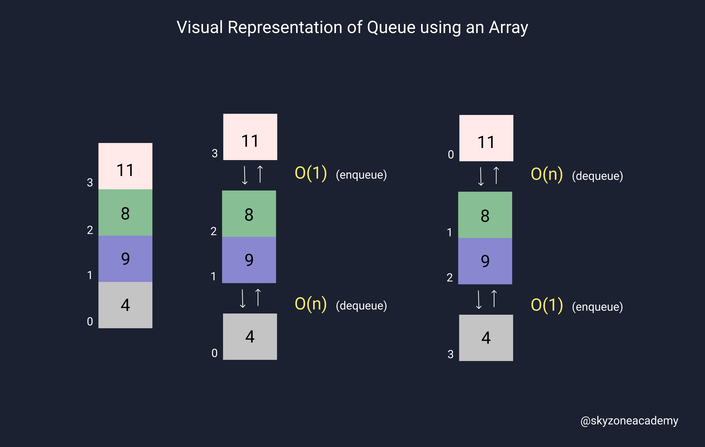
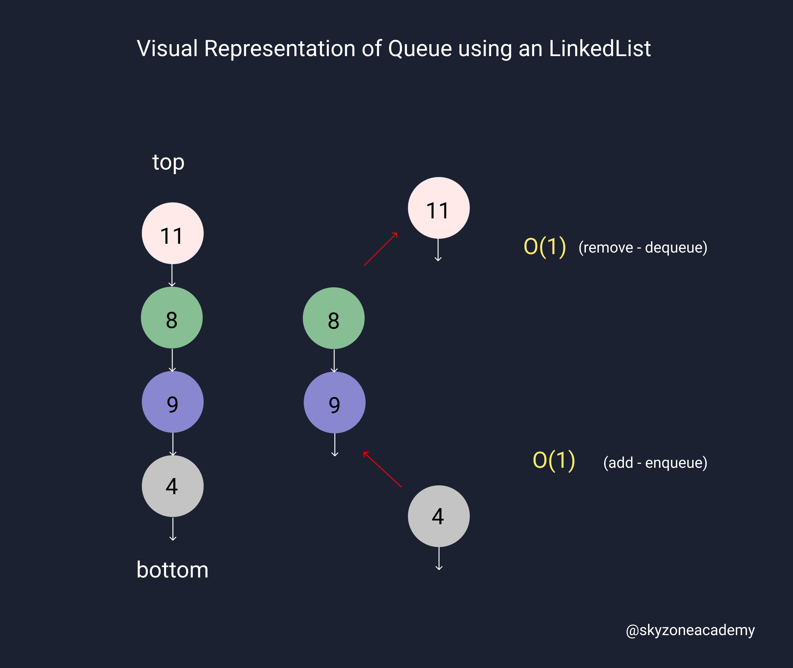

# Queue

## Intrduction

- They are similar to **arrays** in that they are a **sequenced order** of numbers.
- The difference is they only allow access to the **first element**.
- **FIFO** (first in, first out).
- They **aren’t** supported natively in Javascript.
- To utilize this structure, one needs to create the class themselves.
- Queues provide two common methods: **enqueue** and **dequeue**.
- We can use `arrays` or `linkedlists` to implement a stack.

## Array Implementation Example

---

```javascript
class Queue() {
    constructor() {
        this.items = [];
    }
    // add
    enqueue(element) {
        this.items.push(element);
    }
    // remove 
    dequeue() {
        this.items.shift();
    }
    get first() {
        return this.items[0];
    }
    isEmpty() {
        return this.items.length === 0;
    }
    size() {
        return this.items.length;
    }
}

let queue = new Queue();
stack.enqueue("Saint");
stack.enqueue("Lee");
stack.enqueue("Hannah");
console.log(stack.first()); // "Saint"
```

## LinkedList Implementation Example

---

```javascript
class Node {
    constructor(value) {
        this.value = value;
        this.next = null;
    }
}

class Queue2 {
    constructor(value) {
        const newNode = new Node(value);
        this.first = newNode;
        this.last = newNode;
        this.length = 1;
    }
        // add item to the queue (from the end(last))
    enqueue(value) {
        const newNode = new Node(value);
        if (this.length === 0) {
            this.first = newNode;
            this.last = newNode;
        } else {
            this.last.next = newNode;
            this.last = newNode;
        }
        this.length++;
        return this;
    }
    // remove item from the queue (from the top(first))
    dequeue() {
        if (this.length === 0) {
        return null;
        }
        const temp = this.first;
        if(this.length === 1) {
            this.first = null;
            this.last = null;
        } else {
            this.first = this.first.next;
            temp.next = null;
        })

        this.length--;
        return temp;
    }

}

let queue2 = new Queue2(1);
console.log(queue2.enqueue(2));
console.log(queue2.enqueue(3));
console.log(queue2.dequeue());  // 1
```

## Array-Based Queue or LinkedList-Based Queue ?

- You might be wondering which stack implementation to choose.
- Lets analyze the pros and cons of each implementation.
- In general, `array` is beginner friendly, but `linkedlist` is a good practice and memory efficient.

#### Big O analysis:

> Array

- We can't get around without O(n) time complexity, whichever end we choose.
- Adding to the front is O(n), removing from the end is O(1).

```
Array add to end: O(1)
Array remove from front: O(n)
```



> LinkedList

- Adding and removing from head is O(1) and adding to tail is O(1) and removing from tail is O(n).
- So, you don't want to remove from tail(end) when you use LinkedList in queue.

```
LL add from top: O(1)
LL remove from top: O(1) // this
LL add to bottom: O(1) // this
LL remove from bottom: O(n) // but we never use this end when implementing queues
```



#### Read More 

[Array-Based vs List-Based Stacks and Queues](https://stackoverflow.com/questions/7477181/array-based-vs-list-based-stacks-and-queues)

[Queue using Circular array](https://www.youtube.com/watch?v=V6X6yXvT9uI&t=184s&ab_channel=CodeWhoop)

---

Copyright © | SkyZone Academy
