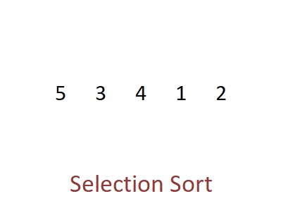

# BASIC SORTING


## Bubble Sort

Bubble Sort is the simplest sorting algorithm that works by repeatedly swapping the adjacent elements if they are in wrong order. [Reference](https://www.geeksforgeeks.org/)

### Demo


### Code

```javascript
function bubbleSort(array) {
    for(let i = array.length - 1; i > 0; i--) {
        for(let j = 0; j < i; j++) {
            if(array[j] > array[j+1]) {
                let temp = array[j]
                array[j] = array[j+1]
                array[j+1] = temp        
           }
        }
    }
    return array;
}
 
bubbleSort([4,2,6,5,1,3])
```

## Selection Sort

The selection sort algorithm sorts an array by repeatedly finding the minimum element (considering ascending order) from unsorted part and putting it at the beginning. The algorithm maintains two subarrays in a given array.
1) The subarray which is already sorted. 
2) Remaining subarray which is unsorted.
In every iteration of selection sort, the minimum element (considering ascending order) from the unsorted subarray is picked and moved to the sorted subarray. [Reference](https://www.geeksforgeeks.org/selection-sort/)

### Demo



### Code

```javascript
function selectionSort(array) {
    for(let i = 0; i < array.length - 1; i++) {
        let min = i
        for(let j = i+1; j < array.length; j++) {
            if(array[j] < array[min]) {
                min = j
            }
        }
        if(i !== min) {
            let temp = array[i]
            array[i] = array[min]
            array[min] = temp
        }
    }
    return array
}

selectionSort([4,2,6,5,1,3])
```

## Insertion Sort

Insertion sort is a simple sorting algorithm that works similar to the way you sort playing cards in your hands. The array is virtually split into a sorted and an unsorted part. Values from the unsorted part are picked and placed at the correct position in the sorted part. [Reference](https://www.geeksforgeeks.org/)

### Demo


### Code

```javascript
function insertionSort(array) {
    let temp
    for(let i = 1; i < array.length; i++) {
        temp = array[i]
        for(var j = i - 1; array[j] > temp && j > -1; j--) {
            array[j+1] = array[j]
        }
        array[j+1] = temp
   }
   return array
}

insertionSort([4,2,6,5,1,3]);
```

