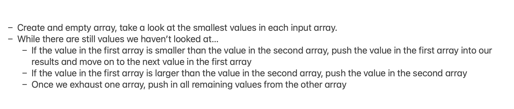
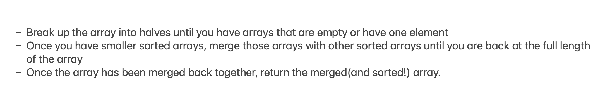
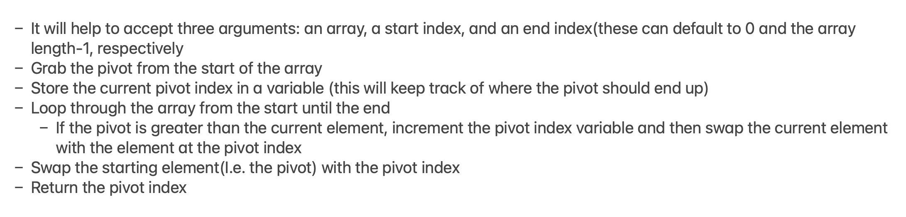
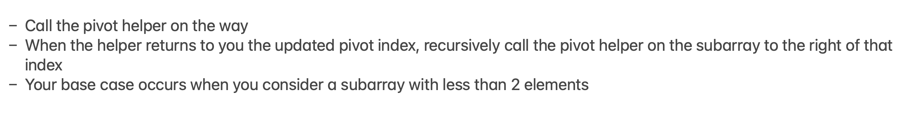

## Merge Sort

Merge sort is one of the most efficient sorting algorithms. It works on the principle of Divide and Conquer. Merge sort repeatedly breaks down a list into several sublists until each sublist consists of a single element and merging those sublists in a manner that results into a sorted list. [Reference](https://www.interviewbit.com/tutorial/merge-sort-algorithm/)

We usually use [Recursion](https://en.wikipedia.org/wiki/Recursion_(computer_science)) for this sorting algoritm (Although it can be done iteratively with Bottom-Up Merge Sort method)

### Demo


- [Visualgo Demo](https://visualgo.net/en/sorting)


### Video Tutorial
[Merge sort in 3 minutes](https://www.youtube.com/watch?v=4VqmGXwpLqc&ab_channel=MichaelSambol)


### Code

> A **mergeSort** divides the input array into two halves, calls itself for the two halves, and then merges the two sorted halves. The **merge()** function is used for merging two halves.

> The **merge(array1, array2)** is a key process that assumes that **array1** and **array2** are sorted and merges the two sorted sub-arrays into one.


**Merging PseudoCode**



**Sorting PseudoCode**



```javascript

    function merge(array1, array2) {
        let combined = []
        let i = 0
        let j = 0
        while(i < array1.length && j < array2.length) {
            if(array1[i] < array2[j]) {
                combined.push(array1[i])
                i++
            } else {
                combined.push(array2[j])
                j++
            }
        }
        while(i < array1.length) {
            combined.push(array1[i])
            i++
        }
        while(j < array2.length) {
            combined.push(array2[j])
            j++
        }
        return combined
    }

    function mergeSort(array) {
        if(array.length === 1) return array

        let mid = Math.floor(array.length/2)
        let left = array.slice(0,mid)
        let right = array.slice(mid)
        
        return merge(mergeSort(left), mergeSort(right))
    }

    mergeSort([3,1,4,2]);

```

### Big O
- **O(n log n) time** | Note: for sorting algorithms n log n is as good as it gets
- **O(n) space** 
- [CheatSheet](https://www.bigocheatsheet.com/)


---

## Quick Sort

Quick Sort is a sorting algorithm, which is commonly used in computer science. Quick Sort is a divide and conquer algorithm. It creates two empty arrays to hold elements less than the pivot value and elements greater than the pivot value, and then recursively sort the sub arrays. 

There are two basic operations in the algorithm, **swapping items** in place and **partitioning** a section of the array.**
[Reference](https://medium.com/karuna-sehgal/a-quick-explanation-of-quick-sort-7d8e2563629b)

There are many different versions of quickSort that pick pivot in different ways. 

1. Always pick first element as pivot (implemented below)
2. Always pick last element as pivot
3. Pick a random element as pivot
4. Pick median as pivot


### Demo


- [Visualgo Demo](https://visualgo.net/en/sorting)


### Video Tutorial
[Quick sort in 4 minutes](https://www.youtube.com/watch?v=Hoixgm4-P4M&ab_channel=MichaelSambol)


### Code
> The key process in quickSort is partition (pivot() function)

**Pivot PseudoCode**



**Sorting PseudoCode**



```javascript

    function swap(array, firstIndex, secondIndex) {
        let temp = array[firstIndex]
        array[firstIndex] = array[secondIndex]
        array[secondIndex] = temp
    }

    function pivot(array, pivotIndex=0, endIndex=array.length-1) { 
        let swapIndex = pivotIndex
        for (let i = pivotIndex + 1; i <= endIndex; i++) {
            if (array[i] < array[pivotIndex]) {
                swapIndex++
                swap(array, swapIndex, i)
            }
        }
        swap(array, pivotIndex, swapIndex)
    
        return swapIndex
    }

    function quickSort(array, left=0, right=array.length-1) {
        if(left < right) {
            let pivotIndex = pivot(array, left, right)
            quickSort(array, left, pivotIndex-1)
            quickSort(array, pivotIndex+1, right)
        }
        return array
    } 

            
    quickSort([4,6,1,7,3,2,5])

```
### Big O

- **O(n log n) time** | best case for random data, if you have already sorted data => **O(n^2)** possible scenario
- **O(log n) space** 
- [CheatSheet](https://www.bigocheatsheet.com/)
